# Tweeter Project

Tweeter is a simple single-page AJAX-based Twitter-like clone that uses jQuery, HTML5 and plain CSS3 to help get comfortable with front-end technologies.

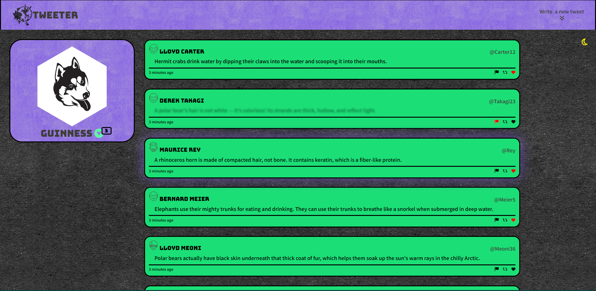

---
## Contents
1. [Features](#features)
2. [Extra Features](#extra-features)
3. [Future Plans](#future-plans)
4. [Quick Start](#quick-start)
5. [Detailed Operation](#detailed-operation)
6. [Known Bugs](#known-bugs)
8. [Updates](#updates)
---
## Features
- Easy to use
- Mobile and Desktop Friendly
  - Mobile view under 1024 pixels
- Slide open & close 'new tweet' box depending on click and scroll location
- Escape text to ensure no one can change html script

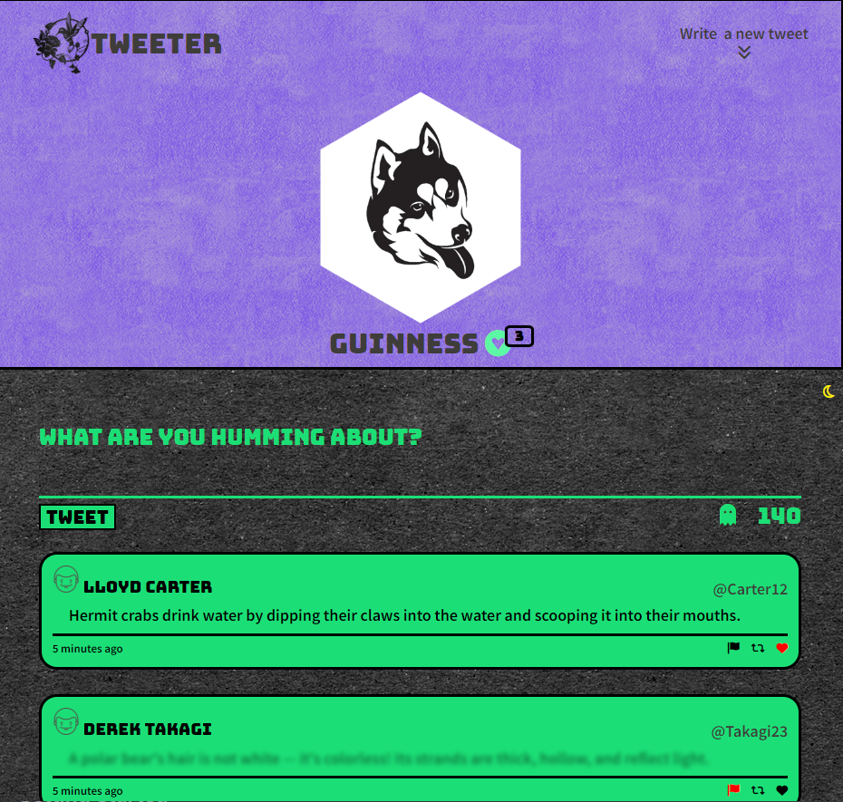

[( back to top 🔺)](#about)

---
## Extra Features
- Light and Dark Mode
- Flag Tweet (blurs out tweet), Like Tweet (turns heart red), Retweet (copies and pastes to tweet input area)
- Generate random tweet from array of tweets
- Show Favourites (shows only liked tweets)
- Various tool tips
- Various animations on Back to Top, Tweet Submit Button, and Generate 
Random Tweet 
- Charater count with warning if close to max characters and over max characters
- Tweet input validation on submit (too long/no tweet)
- Loads 10 tweets initially and more on click 'load more tweets'
- Badge counter for liked tweets and remaining tweets to load
- Local storage used to remember flagged tweets, liked tweets, light and dark mode and fav tweets list
- Hand pointer on clickable elements
- _Stretch_: 'Back To Top' toggle On/Off depending on scroll location
- _Stretch_: CSS uses SASS with nested, variables, mixins, extend

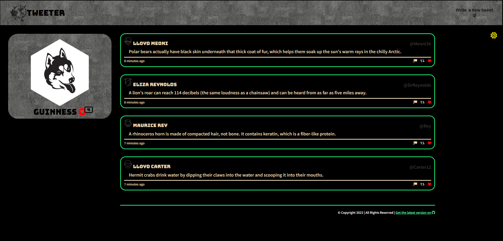

[( back to top 🔺)](#about)

---
## Future Plans
- Create proper storage instead of using local storage
- Add function to pull random tweets from API

[( back to top 🔺)](#about)

---
## Quick Start
1) [Create](https://docs.github.com/en/repositories/creating-and-managing-repositories/creating-a-repository-from-a-template) a new repository in GitHub. 
2) Clone your repository to your local device.
3) Install dependencies with  
  `npm install`   
4) Start the Tweeter Server in your terminal with `nodemon`  
  `npm run local`
5) Start the web app in your browser with  
  `localhost:8080`

[( back to top 🔺)](#about)

---
## Detailed Operation
1) [Create](https://docs.github.com/en/repositories/creating-and-managing-repositories/creating-a-repository-from-a-template) a new repository in GitHub. 
2) Clone your repository to your local device.
3) Install dependencies with    
  `npm install`   
4) Start the Tweeter Server in your terminal with `nodemon`  
  `npm run local`
5) Start the web app in your browser with  
  `localhost:8080`    
  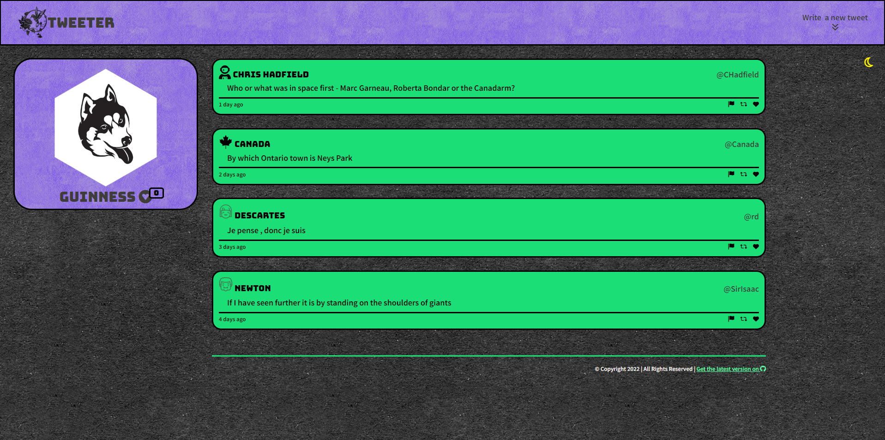
6) Toggle between light and dark mode with the moon/sun    
  *Page will remember your settings on refresh!*   
  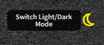   
  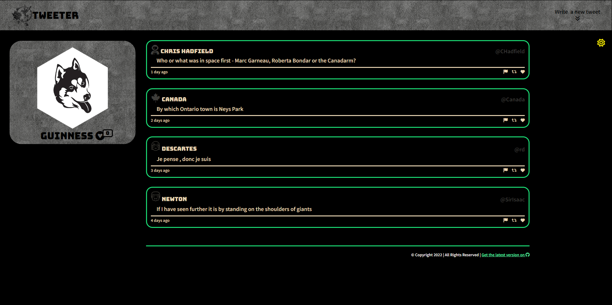    
7) Page will update based on screen width < 1024 px -> mobile view    
  
8) Click 'Write a new Tweet' to add a new tweet   
  *New Tweet form will slide down*      
  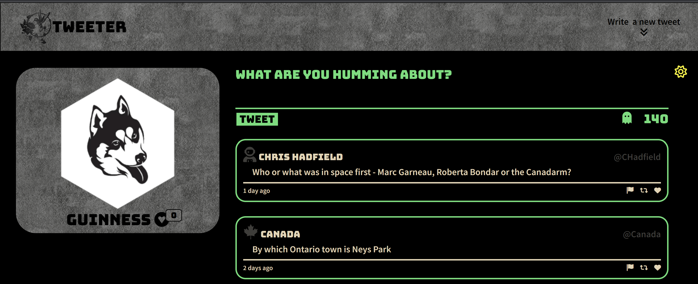   
  *As you type your tweet, counter will update and warn you when you are getting close to max length...*    
  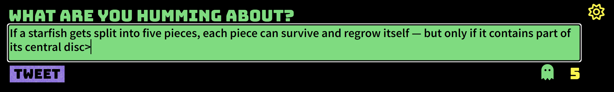    
  *...and once you've exceeded max characters*   
  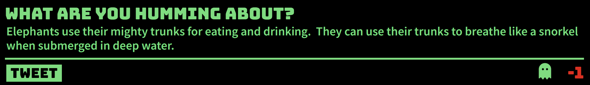    
  *Submit tweet will shake to remind you to submit the tweet you've typed*    
  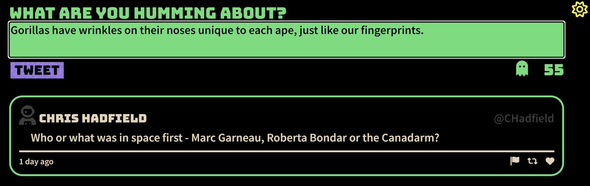    
  *Click on Ghost to generate random tweet*
  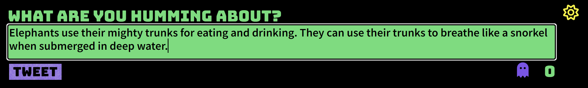
9) If the tweet is too long or no tweet entered - data validation will prevent submission of the tweet.
  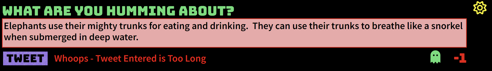
  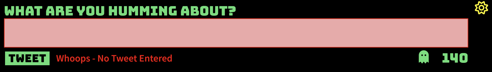
10) Click the 'flag' of a tweet to blur the tweet
  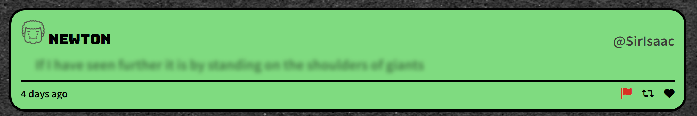
11) Click the 'heart' of a tweet to add to favourite tweets
  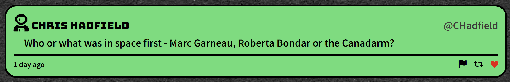
  *Favs badge will update with number of liked tweets*
  *When one or more tweets are liked, favs badge will turn green*
  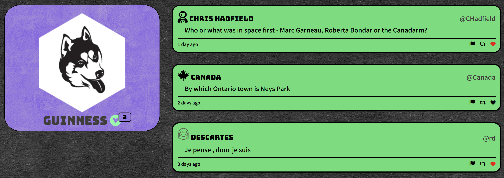
12) Click the 'retweet' to copy the tweet to the tweet input form
  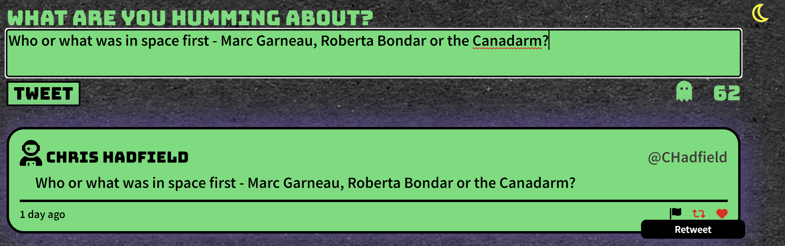
13) If more than 10 tweets available, scroll down to load more tweets
  *Badge will show remaining tweets available*
  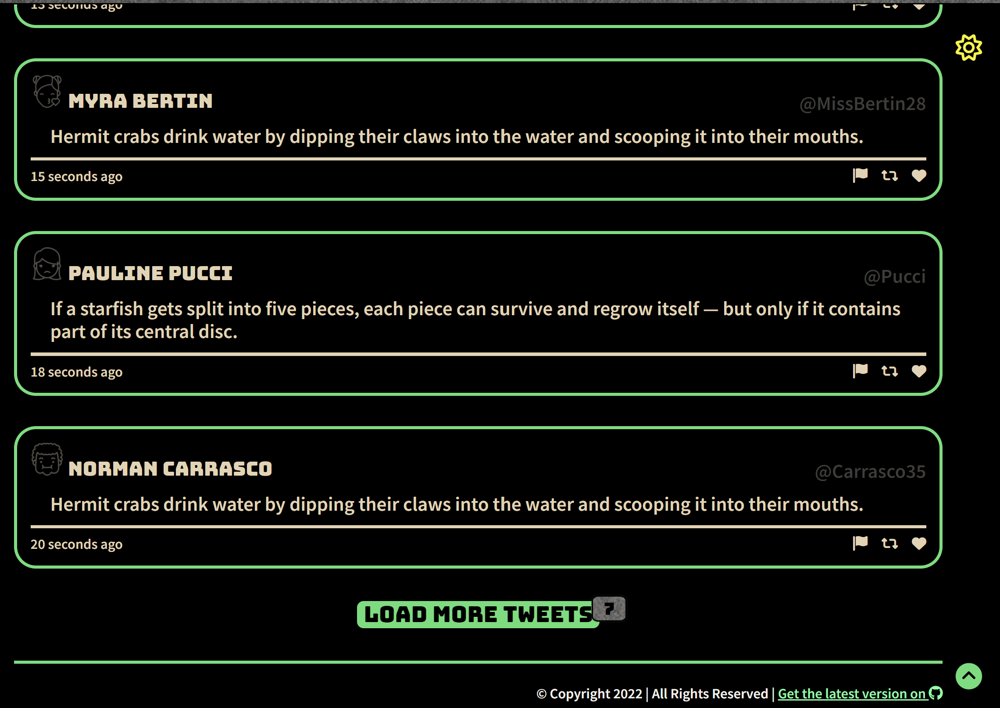
14) Use green up arrow to scroll back to top
  *Arrow will appear and disappear automatically based on page scroll position*
  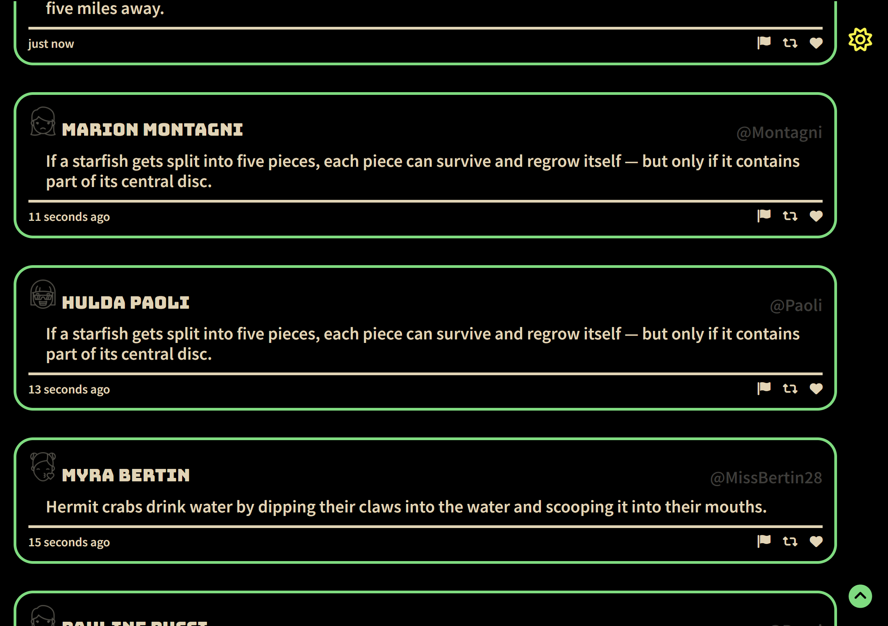
15) Click on the favourite tweets to get a subset of liked only tweets
  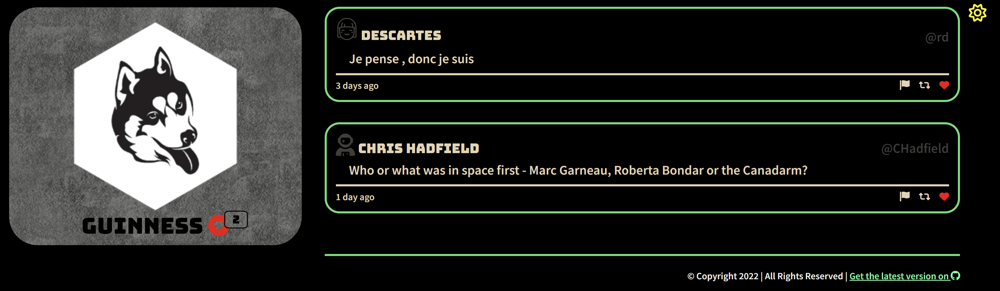
  *If no tweets are liked, error message will appear*
  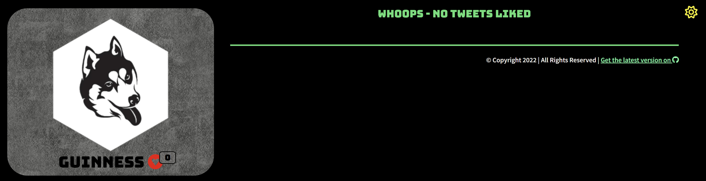

Checkout our demo video [here!](./images/2022-09-12%2015-38-25.mov) 

[( back to top 🔺) ](#about)

----
## Known Bugs
- When click action is to scroll to certain location on page -> loads at top then scroll to location

[( back to top 🔺)](#about)

----
## Updates
- Get the most recent version of Tweeter! [on our GitHub account here.](https://github.com/jradigan17/tweeterjr).
- Change Log v 0.0 - 2022-09-12:  
    * (implementation)

[( back to top 🔺)](#about)

---
## Dependencies

- express
- node 5.10.x or above
- body-parser
- chance
- md5
- nodemon

[( back to top 🔺)](#about)

---